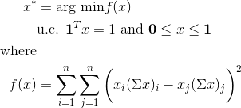

[](https://travis-ci.org/matthewgilbert/erc)
[](https://coveralls.io/github/matthewgilbert/erc?branch=master)

# Description

This is an implementation of the equal weighted risk contributions algorithm (6)
outlined in *"On the properties of equally-weighted risk contributions
portfolios"* by *Maillard, Roncalli, and Teiletche* available
[here](https://papers.ssrn.com/sol3/papers.cfm?abstract_id=1271972).

<!---
\begin{align*}
x^{*} &= \text{arg min} f(x)\\
&\text{u.c.  } \textbf{1}^T x = 1 \text{ and } \textbf{0} \leq x \leq \textbf{1}\\
\text{where}\\
f(x) &= \sum_{i=1}^{n}\sum_{j=1}^{n}\bigg{(}x_i(\Sigma x)_i - x_j(\Sigma x)_j\bigg{)}^{2}
\end{align}
-->




# Install

You can pip install this package from github, i.e.

```
pip install git+git://github.com/matthewgilbert/erc.git@master
```

# Requires

```
numpy
scipy
```

For testing also requires

```
coveralls
flake8
pytest-cov
```
